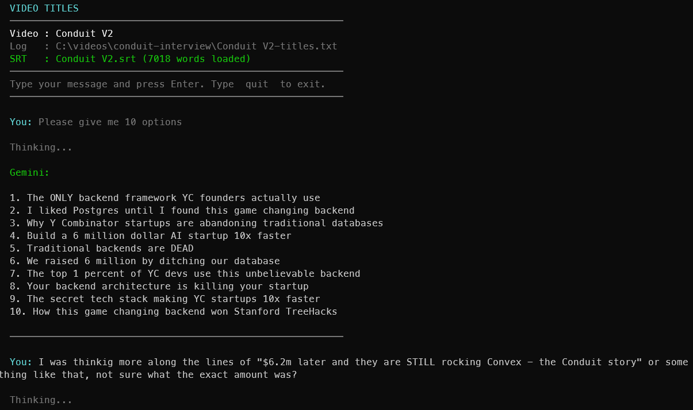

#  video-titles

Right-click a video and chat with Gemini about what to call it

Windows · macOS

<!-- media: hero -->
<!--  -->
<!-- /media: hero -->

## What it is

I'm not great at coming up with YouTube titles, so this gives me someone to bounce ideas off. It loads the video's transcript, then drops you into a chat with Gemini that's been primed with the Compelling Title Matrix framework.

If there's no transcript yet it offers to run my transcribe tool for you first. Every exchange gets saved to a text file next to the video so the ideas don't get lost.

## Get it

Paste this into your AI coding agent (Claude Code, Codex, Cursor...):

> Clone https://github.com/mikecann/video-titles and make it my own. It's one of Mike
> Cann's personal tools, so read the README first, change anything specific to his
> setup to suit mine, then help me get it running.

### Or set it up by hand

Install [Bun](https://bun.sh). On Windows, `winget install oven-sh.bun` works, then open a new terminal. The macOS launcher also needs Python 3. You'll need an [OpenRouter API key](https://openrouter.ai/keys) to chat with Gemini.

```sh
git clone https://github.com/mikecann/video-titles
cd video-titles
```

On Windows, from PowerShell:

```powershell
Copy-Item .env.example .env
notepad .env
powershell -NoProfile -ExecutionPolicy Bypass -File .\install.ps1
```

Set `OPENROUTER_API_KEY` in `.env`. The installer runs `deps.ps1`, writes launchers into `C:\dev\tools`, offers to add that folder to your User PATH, and adds **Mike's Tools > Video Titles** to the video file context menu. Keep the clone in a path with only ASCII characters, for example `C:\dev\video-titles`.

On macOS:

```sh
cp .env.example .env
open -e .env
bash install.sh
```

Set `OPENROUTER_API_KEY` in `.env`. The installer installs the Bun packages and links the launcher into `~/.local/bin`. Add that directory to your shell's PATH if needed:

```sh
export PATH="$HOME/.local/bin:$PATH"
```

Put that line in `~/.zshrc` to keep it for future terminals. You can choose another directory with `bash install.sh /path/to/bin`.

Keep the clone where you installed it, because the launchers point back to it. After moving it, rerun the installer. For an update, run `git pull` and `bun install --frozen-lockfile` in the clone. Both installers accept a dependency skip option: `-SkipDeps` on Windows, `--skip-deps` on macOS.

## Using it

```sh
video-titles "/path/to/my video.mp4"
```

On Windows you can also right-click a video in File Explorer and choose **Mike's Tools > Video Titles**. On Windows 11, click **Show more options** first.

The tool looks for `<videoname>.srt` alongside the video. If it finds one, it loads the transcript as context. Otherwise it offers to run [transcribe](https://github.com/mikecann/transcribe), which is optional and installed separately. You can skip that and paste context into the chat yourself.

It asks Gemini for ten title options to start, then you can type feedback and press Enter. Type `quit`, `exit`, `q` or `:q` to leave, or press Ctrl+C. Exchanges are appended to `<videoname>-titles.txt` next to the video. Opening the same video again resumes the saved conversation.

## Screenshots



## Configuration and model

`.env` lives in this clone, beside `index.ts`. You can also set `OPENROUTER_API_KEY` in your environment, which takes precedence. The launchers disable Bun's automatic loading of `.env` from the current working directory so a video folder does not change your configuration.

The code uses `google/gemini-3.1-pro-preview` through `https://openrouter.ai/api/v1/chat/completions`. To change it, edit `MODEL` at the top of `index.ts`. The title framework is in `SYSTEM_PROMPT` in the same file, so you can change it to suit the videos you make. The transcript and chat messages are sent to OpenRouter when you ask for titles.

## Troubleshooting

- If `video-titles` is not found, open a new terminal and check the install directory is on PATH.
- If Bun is not found, install it and reopen the terminal before running the installer.
- If the API key is missing, copy `.env.example` to `.env` in this clone and fill in the value.
- If automatic transcription is unavailable, install [transcribe](https://github.com/mikecann/transcribe) separately or place an SRT file beside the video. Windows checks `C:\dev\tools\transcribe.bat` first, then falls back to PATH.
- API errors are printed in the terminal. Check your OpenRouter key, available credit and access to the configured model.

## Development

```sh
bun install --frozen-lockfile
bun test
bunx tsc --noEmit
bash -n install.sh video-titles
```

With PowerShell installed, run `pwsh -NoProfile -File tests/install-lib.Tests.ps1` too. CI runs the Bun tests and TypeScript checks, then parses every PowerShell script and tests installer helpers on Windows. Tests use mocked API responses and do not need a key, model downloads or hardware.

## Uninstalling

On Windows, run `powershell -NoProfile -ExecutionPolicy Bypass -File .\uninstall.ps1` from this clone. It removes this tool's launchers, icon and `VideoTitles` menu verbs. It leaves the shared submenu, other tools and PATH in place.

On macOS, remove the symlink with `rm ~/.local/bin/video-titles`, or use the directory you chose during installation. Your clone and saved chats remain in place on either platform.

## More tools

You can find my other tools at [mikerosoft.app](https://mikerosoft.app).

MIT licensed.
